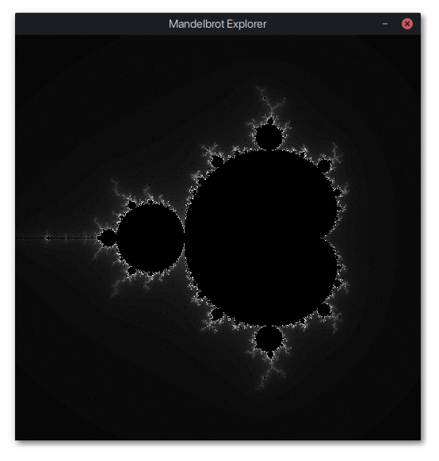

# mandelbrot-explorer

A small mandelbrot explorer application written in Rust. You can zoom in with left click and dragging and zoom out by right clicking.

[Download it from the releases page](https://github.com/haselkern/mandelbrot-explorer/releases).

TODO:
 * Support different window sizes.
 * Prevent the empty resources folder from being created.
 * Different colors?

